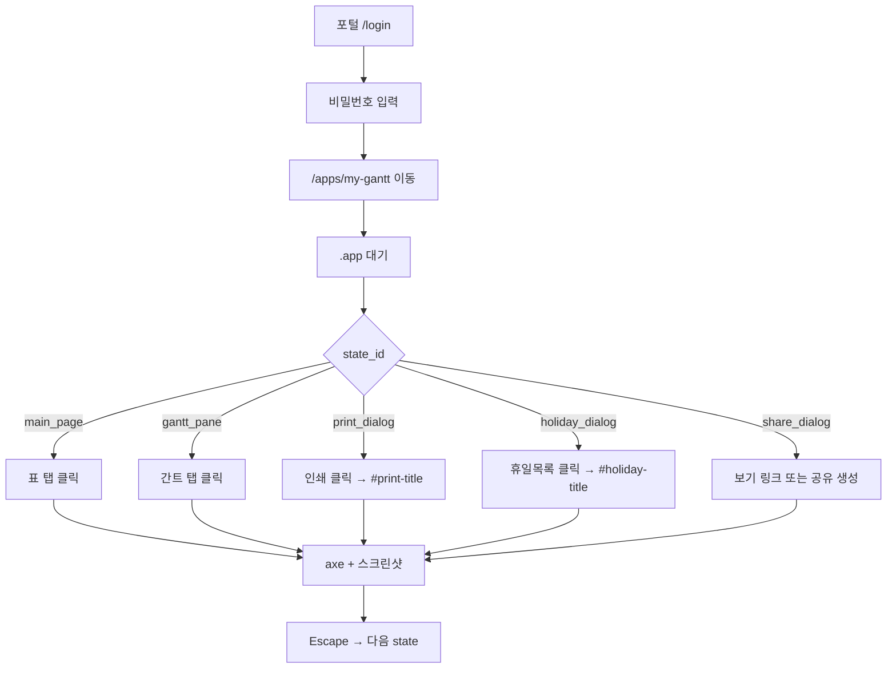

# MyGantt 웹 품질 진단 시나리오 작성 가이드

MyPlatform **웹 품질 진단**에서 MyGantt를 ER Modeler 수준(여러 화면·다이얼로그)으로 점검하려면  
**manifest(무엇을 검사할지)** 와 **Playwright(화면을 여는 방법)** 를 코드로 추가합니다.

> **현재 상태 (2026-08)**  
> - MyGantt는 **메인 화면 1장**만 런타임 진단 (`main_page`)  
> - 소스(TSX) 정적 스캔은 `page.tsx`, `GanttApp.tsx`, `GanttChart.tsx`, `TaskTable.tsx` 등  
> - 인쇄·공유·휴일 다이얼로그 시나리오는 **아직 미구현** — 본 문서는 추가 방법을 설명합니다.

---

## 1. 진단 시나리오란?

| 구분 | 역할 | 작성 위치 |
|------|------|-----------|
| **UI 상태 목록** | 검사할 화면(기능) 이름·설명 | `apps/api/web_quality/manifest.py` |
| **화면 열기 로직** | 버튼 클릭·DOM 대기 | `apps/api/web_quality/playwright_scanner.py` |
| **(권장) 진단용 속성** | 안정적인 선택자 | `apps/portal/lib/mygantt/**/*.tsx` |

사용자가 `/apps/web-quality` UI에서 시나리오를 **직접 작성하지 않습니다.**  
개발자가 위 파일을 수정한 뒤, 사용자는 **MyGantt 선택 → 진단 실행**만 합니다.

### state_id 규칙

- **소스 함수명이 아님** (`onPrint`, `setPrintOpen` 등과 무관)
- **영문 snake_case** 로 기능을 짧게 표현 (`print_dialog`, `gantt_pane`)
- `label` / `description` 은 **한글** (보고서·화면캡처 탭에 표시)

---

## 2. MyGantt 화면 구조 (화면 맵)

### 2.1 전체 레이아웃

```
┌─────────────────────────────────────────────────────────────────┐
│ PortalNav (포털 공통 상단)                                        │
├─────────────────────────────────────────────────────────────────┤
│ .mygantt > .app                                                  │
│  ┌─ ProjectHeader (.project-header) ─────────────────────────┐  │
│  │ h1 "MyGantt" · 프로젝트명 · 메타 입력 · 액션 버튼들          │  │
│  └───────────────────────────────────────────────────────────┘  │
│  ┌─ workspace-tabs [role=tablist] ───────────────────────────┐  │
│  │  [ 표 ]  [ 간트 ]                                            │  │
│  └───────────────────────────────────────────────────────────┘  │
│  ┌─ .workspace ──────────────────────────────────────────────┐  │
│  │ TaskTable (좌) │ splitter │ GanttChart (우)                  │  │
│  └───────────────────────────────────────────────────────────┘  │
└─────────────────────────────────────────────────────────────────┘
```

**진입 URL:** `{포털 URL}/apps/my-gantt`  
**준비 대기:** `.app` 또는 `h1.brand` (현재 manifest: `ready_selector: "main"`)

### 2.2 모달(다이얼로그) 3종

| 화면 | 컴포넌트 | 제목 (h2 id) | CSS 클래스 | 열기 방법 |
|------|----------|--------------|------------|-----------|
| 인쇄 | `PrintDialog.tsx` | `#print-title` "인쇄" | `.print-dialog` | 헤더 **「인쇄」** 버튼 |
| 공유 링크 | `ShareLinksDialog.tsx` | `#share-title` "공유 링크" | `.share-dialog` | **「공유 링크 만들기」** 성공 후, 또는 **「보기 링크」** |
| 휴일목록 | `HolidayEditor.tsx` | `#holiday-title` "휴일목록" | `.modal` (generic) | **「휴일목록 (N)」** 버튼 |

모달 공통 패턴:

```html
<div class="modal-backdrop" role="presentation">
  <div class="modal …" role="dialog" aria-labelledby="…-title">
    <h2 id="…-title">제목</h2>
    <button>닫기</button>
  </div>
</div>
```

### 2.3 탭(표 / 간트)

| state_id (제안) | label | 설명 | DOM |
|-----------------|-------|------|-----|
| `main_table_pane` | 표 보기 | TaskTable 중심 | `.workspace-tabs button:has-text("표")` 활성 |
| `main_gantt_pane` | 간트 보기 | GanttChart 중심 | `.workspace-tabs button:has-text("간트")` 활성 |

---

## 3. 권장 진단 시나리오 (상태 목록)

ER Modeler처럼 **기능 단위**로 나눈 권장 `ui_states` 입니다.

| 우선순위 | state_id | label (한글) | required | 비고 |
|----------|----------|--------------|----------|------|
| ★★★ | `main_page` | 메인 화면 | true | 기본 진입 (표 탭) |
| ★★★ | `print_dialog` | 인쇄 | true | Supabase 불필요 |
| ★★☆ | `holiday_dialog` | 휴일목록 | true | Supabase 불필요 |
| ★★☆ | `gantt_pane` | 간트 탭 | false | 탭 전환만 |
| ★☆☆ | `share_dialog` | 공유 링크 | false | **Supabase 설정 필요** |
| — | `print_preview_table` | 인쇄(표만) | false | `window.print()` — headless에서 스킵 권장 |

**제외 권장 (자동 진단 위험/불가):**

- **가져오기** — `<input type="file">` 파일 선택 필요
- **삭제 / 초기화 / 새 프로젝트** — `confirm()` + 데이터 변경
- **공유 링크 만들기** — 서버 API + alert; 실패 시 다이얼로그 없음

---

## 4. 작성 절차 (3단계)

### 4.1 1단계 — manifest.py 에 상태 목록 추가

`apps/api/web_quality/manifest.py` 에 상수를 추가하고 `my-gantt` 타깃에 연결합니다.

```python
MY_GANTT_UI_STATES = [
    {
        "state_id": "main_page",
        "label": "메인 화면",
        "description": "MyGantt 기본 — 프로젝트 헤더, 표 탭, TaskTable",
        "required": True,
    },
    {
        "state_id": "gantt_pane",
        "label": "간트 탭",
        "description": "간트 차트 패널 활성화",
        "required": False,
    },
    {
        "state_id": "print_dialog",
        "label": "인쇄",
        "description": "인쇄 모달 — 표만 / 표+간트 선택",
        "required": True,
    },
    {
        "state_id": "holiday_dialog",
        "label": "휴일목록",
        "description": "휴일 편집 모달",
        "required": True,
    },
    {
        "state_id": "share_dialog",
        "label": "공유 링크",
        "description": "보기/편집 링크 복사 모달 (Supabase 필요)",
        "required": False,
    },
]

# TARGETS 내 my-gantt 항목:
{
    "id": "my-gantt",
    "name": "MyGantt",
    "path": "/apps/my-gantt",
    "ready_selector": ".app",  # main 보다 앱 루트가 명확
    "ui_states": MY_GANTT_UI_STATES,
},
```

### 4.2 2단계 — playwright_scanner.py 에 열기 함수 추가

`target_id == "my-gantt"` 일 때 ER Modeler 대신 전용 함수를 사용합니다.

```python
def _open_my_gantt_state(page, state_id: str) -> tuple[bool, str]:
    try:
        page.wait_for_selector(".app", timeout=30000)

        if state_id == "main_page":
            page.locator('.workspace-tabs button:has-text("표")').click()
            page.wait_for_selector(".workspace.pane-table", timeout=10000)
            return True, ""

        if state_id == "gantt_pane":
            page.locator('.workspace-tabs button:has-text("간트")').click()
            page.wait_for_selector(".workspace.pane-gantt", timeout=10000)
            return True, ""

        if state_id == "print_dialog":
            page.keyboard.press("Escape")
            page.wait_for_timeout(300)
            page.locator('.header-actions button:has-text("인쇄")').click()
            page.wait_for_selector("#print-title", timeout=10000)
            return True, ""

        if state_id == "holiday_dialog":
            page.keyboard.press("Escape")
            page.wait_for_timeout(300)
            page.locator('.header-actions button:has-text("휴일목록")').click()
            page.wait_for_selector("#holiday-title", timeout=10000)
            return True, ""

        if state_id == "share_dialog":
            # 방법 A: 이미 shareId가 있으면 "보기 링크" 클릭
            view_btn = page.locator('button:has-text("보기 링크")')
            if view_btn.count():
                view_btn.click()
                page.wait_for_selector("#share-title", timeout=10000)
                return True, ""
            # 방법 B: Supabase 설정 + "공유 링크 만들기" (서버 의존)
            create_btn = page.locator('button:has-text("공유 링크 만들기")')
            if not create_btn.count():
                return False, "공유 UI 없음 — Supabase 미설정 또는 이미 공유 중"
            create_btn.click()
            page.wait_for_selector("#share-title", timeout=30000)
            return True, ""

        return False, f"알 수 없는 state_id: {state_id}"
    except Exception as e:
        return False, str(e)
```

`scan_portal_target_runtime()` 분기 예:

```python
if target_id == "er-modeler":
    open_fn = _open_er_modeler_state
elif target_id == "my-gantt":
    open_fn = _open_my_gantt_state
else:
    open_fn = lambda pg, sid: _open_generic_state(pg, sid, ready)
```

### 4.3 3단계 — (권장) 진단용 data-wq-* 속성 추가

ER Modeler 패턴을 MyGantt에 맞게 적용하면 **텍스트/구조 변경에 강해집니다.**

**버튼 (ProjectHeader.tsx):**

```tsx
<button
  type="button"
  className="btn"
  data-wq-target="print_dialog"
  onClick={onPrint}
>
  인쇄
</button>

<button
  type="button"
  className="btn"
  data-wq-target="holiday_dialog"
  onClick={onOpenHolidays}
>
  휴일목록 ({project.holidays.length})
</button>

<button
  type="button"
  className="btn btn-primary"
  data-wq-target="share_create"
  onClick={onCreateShare}
  …
>
  공유 링크 만들기
</button>
```

**다이얼로그 (PrintDialog / ShareLinksDialog / HolidayEditor):**

```tsx
<div
  className="modal print-dialog"
  role="dialog"
  aria-labelledby="print-title"
  data-wq-state="print_dialog"
>
```

Playwright:

```python
page.click('[data-wq-target="print_dialog"]')
page.wait_for_selector('[data-wq-state="print_dialog"]')
```

---

## 5. 화면별 DOM·접근성 체크 포인트

### 5.1 메인 (`main_page`)

| 요소 | 선택자 / 위치 | 진단 관심사 |
|------|----------------|-------------|
| 앱 제목 | `h1.brand` | 제목 계층 (6.4.2) |
| 프로젝트명 | `input.project-title[aria-label="프로젝트명"]` | label/aria |
| 탭 | `[role=tablist]` + 버튼 2개 | tab 역할·키보드 |
| 스플리터 | `[role=separator][aria-label=…]` | 키보드 ←/→ |
| 작업 표 | `TaskTable` | 테이블 헤더·입력 label |

### 5.2 인쇄 (`print_dialog`)

| 요소 | id / class | 진단 관심사 |
|------|------------|-------------|
| 모달 | `#print-title`, `.print-dialog` | `role=dialog`, `aria-labelledby` |
| 선택 버튼 | `.print-choice` × 2 | 버튼 이름(표만/표+간트) |
| 닫기 | `.modal-header .btn-ghost` | 「닫기」 텍스트 |

### 5.3 휴일목록 (`holiday_dialog`)

| 요소 | id / class | 진단 관심사 |
|------|------------|-------------|
| 모달 | `#holiday-title` | dialog 레이블 |
| 테이블 | `.holiday-table` | th/td, date input label |
| 추가 | `.modal-footer .btn-primary` | 「휴일 추가」 |

### 5.4 공유 링크 (`share_dialog`)

| 요소 | id / class | 진단 관심사 |
|------|------------|-------------|
| 모달 | `#share-title`, `.share-dialog` | dialog |
| 링크 입력 | `.share-link-bar input[readonly]` | 읽기 전용 필드 이름 |
| 복사/열기 | `.share-link-bar .btn` | 버튼 accessible name |

**전제 조건:** 포털 `.env.local` 에 Supabase URL/키 설정.  
미설정 시 `onCreateShare` → `alert(SETUP_HINT)` 만 뜨고 `#share-title` 은 **없음** → `required: False` 권장.

---

## 6. 소스 정적 스캔 범위 (이미 manifest에 등록됨)

| 파일 | 내용 |
|------|------|
| `app/apps/my-gantt/page.tsx` | 페이지 셸, PortalNav |
| `app/layout.tsx` | 공통 layout, lang |
| `lib/mygantt/GanttApp.tsx` | 메인 앱·모달 조건 렌더 |
| `lib/mygantt/components/GanttChart.tsx` | 간트 SVG/스크롤 |
| `lib/mygantt/components/TaskTable.tsx` | WBS 테이블 |

다이얼로그 TSX(`PrintDialog`, `ShareLinksDialog`, `HolidayEditor`)를 정적 스캔에 넣으려면  
`manifest.py` → `SOURCE_FILES["my-gantt"]` 배열에 경로를 추가합니다.

---

## 7. 진단 실행 방법

### 7.1 로컬

```powershell
# 터미널 1 — API
$env:PORTAL_PASSWORD="your-password"
npm run dev:api

# 터미널 2 — Portal
npm run dev:portal

# Playwright (최초 1회)
cd apps/api
python -m playwright install chromium
```

1. 브라우저: `http://127.0.0.1:3000/apps/web-quality`
2. **포털 앱** → **MyGantt**
3. 포털 URL / 암호 입력
4. **화면(Playwright + axe) 진단 포함** 체크
5. **진단 실행**

### 7.2 결과 해석

| 메시지 | 의미 |
|--------|------|
| `N건 · 캡처 M장` | 소스+화면 findings, 스크린샷 M개 |
| `캡처 0장` + runtime_error | Playwright 실패 (암호, Chromium, 포털 미기동 등) |
| 화면캡처 탭 | state_id별 전체 화면 + axe 위반 요소 클로즈업 |

---

## 8. 시나리오 흐름도 (Playwright 실행 순서)



---

## 9. ER Modeler vs MyGantt 비교

| 항목 | ER Modeler | MyGantt (권장) |
|------|------------|----------------|
| UI 상태 수 | 8 | 4~5 |
| data-wq-* | 있음 | 추가 권장 |
| 파일 업로드 상태 | import_preview (수동 스킵) | 가져오기 (제외) |
| confirm() | 일부 | 삭제/초기화 (제외) |
| 외부 서비스 | 없음 | 공유 → Supabase |

---

## 10. 체크리스트 (구현 완료 확인)

- [ ] `MY_GANTT_UI_STATES` manifest 등록
- [ ] `ready_selector` → `.app` 또는 `h1.brand`
- [ ] `_open_my_gantt_state` playwright 분기
- [ ] (선택) `data-wq-target` / `data-wq-state` TSX 추가
- [ ] (선택) 다이얼로그 TSX를 `SOURCE_FILES`에 추가
- [ ] 로컬: MyGantt · 화면 포함 · 캡처 ≥ 1장
- [ ] Excel/ZIP 보고서에 화면별 시트·이미지 확인

---

## 11. 참고 파일

| 파일 | 설명 |
|------|------|
| `apps/api/web_quality/manifest.py` | 타깃·ui_states·소스 목록 |
| `apps/api/web_quality/playwright_scanner.py` | 런타임 시나리오 |
| `apps/api/web_quality/static_scanner.py` | TSX 정적 규칙 |
| `apps/api/web_quality/service.py` | 진단 오케스트레이션 |
| `apps/portal/lib/mygantt/GanttApp.tsx` | 모달 open 상태 |
| `apps/portal/lib/mygantt/components/ProjectHeader.tsx` | 액션 버튼 |
| `apps/portal/lib/er-modeler/ErModelerApp.tsx` | data-wq-* 참고 구현 |

---

*문서 버전: MyPlatform web-quality — MyGantt 시나리오 가이드 v1*
