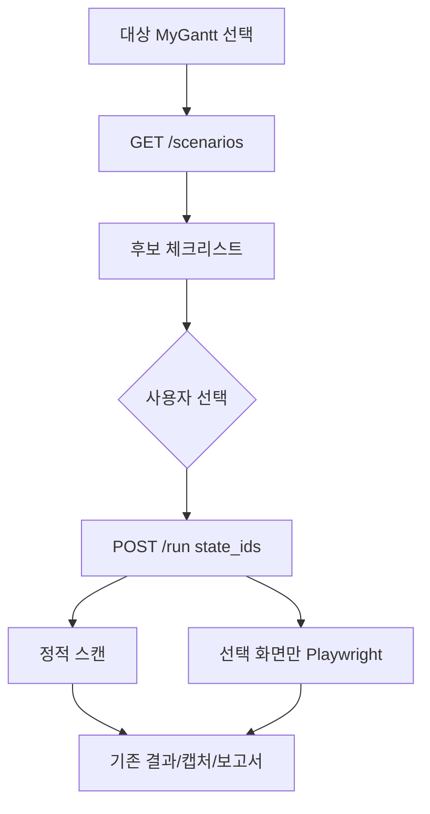

# 소스 → 화면 후보 → 선택 → 진단 (초안)

파일럿: **MyGantt**. LLM 없음. 휴리스틱 추출 + 사용자 선택 + 기존 Playwright/axe.

관련: [my-gantt-scenario-guide.md](./my-gantt-scenario-guide.md)

---

## 1. 목표 / 비목표

### 목표

1. MyGantt TSX를 읽어 **검사할 화면 후보**를 만든다.
2. `/apps/web-quality`에서 후보를 **고른 뒤** 진단한다.
3. 앱마다 `_open_my_gantt_state`를 늘리지 않고, **스텝 JSON**으로 화면을 연다.
4. 위험한 동작(업로드·confirm·print)은 후보에 올리되 **기본 제외**.

### 비목표 (v0)

- LLM으로 시나리오 생성
- 외부 URL 소스 분석
- 시나리오 영구 저장(DB)
- 모든 포털 앱 자동 지원 (추출기 훅만 열어 둠)
- 가져오기 미리보기, 인쇄 미리보기 자동 실행

---

## 2. 현재 대비 변경점

```
지금
  manifest.ui_states (고정) ──► Playwright 앱별 open_fn ──► axe

초안
  소스 추출기 ──► 후보 목록
       │
       ▼
  웹품질 UI에서 선택
       │
       ▼
  run(selected_ids + steps) ──► generic step opener ──► 기존 scan_page_states
```

손대지 않는 것: axe, 캡처, 보고서, 정적 규칙 스캔.

추가하는 것:

| 파일 | 역할 |
|------|------|
| `web_quality/scenario_extract.py` | 소스 → 후보 |
| `web_quality/scenario_steps.py` | 스텝 실행기 |
| `GET /v1/web-quality/scenarios` | 후보 조회 |
| `POST /v1/web-quality/run` | `state_ids` 수신 |
| `apps/portal/.../web-quality/page.tsx` | 후보 체크리스트 |

---

## 3. 데이터 모델

추출 결과 한 건(`ScenarioCandidate`):

```json
{
  "state_id": "print_dialog",
  "label": "인쇄",
  "description": "인쇄 모달 — 표만 / 표+간트 선택",
  "kind": "dialog",
  "source": {
    "files": ["lib/mygantt/components/PrintDialog.tsx"],
    "evidence": "role=\"dialog\" aria-labelledby=\"print-title\""
  },
  "recommended": true,
  "selectable": true,
  "skip_reason": "",
  "risk": [],
  "confidence": "high",
  "open": {
    "ready_selector": ".app",
    "steps": [
      { "action": "press", "key": "Escape" },
      { "action": "click", "selector": "[data-wq-target=\"print_dialog\"]" },
      { "action": "wait", "selector": "[data-wq-state=\"print_dialog\"]" }
    ]
  }
}
```

| 필드 | 의미 |
|------|------|
| `kind` | `page` \| `tab` \| `dialog` \| `popover` \| `skip` |
| `recommended` | UI 기본 체크 |
| `selectable` | false면 체크 불가 (실행 수단 없음) |
| `risk` | `file_input` `confirm` `window.print` `external_service` `destructive` |
| `confidence` | `high` (data-wq 또는 고유 id) / `medium` (버튼 텍스트) / `low` (추정) |

스텝 `action` (v0):

| action | 필드 | 설명 |
|--------|------|------|
| `wait` | `selector`, `timeout_ms?` | 대기 |
| `click` | `selector` | 클릭 |
| `press` | `key` | 키보드 |
| `click_has_text` | `selector`, `text` | Playwright `:has-text` |

`data-wq-*`가 있으면 그걸 쓰고, 없으면 텍스트 클릭으로 떨어진다.

---

## 4. MyGantt 추출 규칙

### 4.1 읽을 파일

`manifest.SOURCE_FILES["my-gantt"]`를 디렉터리로 넓힌다.

```
app/apps/my-gantt/page.tsx
app/layout.tsx
lib/mygantt/GanttApp.tsx
lib/mygantt/components/ProjectHeader.tsx
lib/mygantt/components/PrintDialog.tsx
lib/mygantt/components/HolidayEditor.tsx
lib/mygantt/components/ShareLinksDialog.tsx
lib/mygantt/components/GanttChart.tsx
lib/mygantt/components/TaskTable.tsx
```

`excelExport.ts` 등 비UI는 제외.

### 4.2 시그널 → 후보

| 시그널 | 예 (현재 소스) | 후보 |
|--------|----------------|------|
| 페이지 루트 `.app` / `h1.brand` | `GanttApp.tsx` | `main_page` |
| `role="tablist"` + 버튼 텍스트 | 표 / 간트 | `main_table_pane`, `gantt_pane` |
| `*Dialog.tsx` 또는 `role="dialog"` | Print / Share / Holiday | `print_dialog`, `share_dialog`, `holiday_dialog` |
| `useState(*Open)` | `printOpen`, `holidaysOpen`, `shareOpen` | 위 다이얼로그와 연결 |
| `<input type="file">` | 가져오기 | `import_file` (skip) |
| `confirm(` | 삭제, 초기화 | `delete_project`, `reset_project` (skip) |
| `window.print()` | `runPrint` | `print_preview` (skip) |
| 외부 SDK / env 가드 | `isShareConfigured()` | `share_dialog` risk=`external_service` |

버튼 텍스트 → `state_id` 매핑 (MyGantt 파일럿 테이블):

| 버튼 / 요소 | state_id | recommended | selectable |
|-------------|----------|-------------|------------|
| (진입 화면) | `main_page` | true | true |
| 탭 「표」 | `main_table_pane` | true | true |
| 탭 「간트」 | `gantt_pane` | true | true |
| 「인쇄」 + `#print-title` | `print_dialog` | true | true |
| 「휴일목록」 + `#holiday-title` | `holiday_dialog` | true | true |
| 「공유 링크 만들기」/「보기 링크」 | `share_dialog` | false | true |
| 「가져오기」 file | `import_file` | false | false |
| 「삭제」 confirm | `delete_project` | false | false |
| 「초기화」 confirm | `reset_project` | false | false |
| `window.print` | `print_preview` | false | false |
| 「새 프로젝트」「복제」「엑셀」「JSON」 | 없음 | — | — |

내보내기·복제는 새 DOM 화면이 아니므로 후보에서 뺀다.

### 4.3 열기 스텝 (폴백)

`data-wq-*`가 아직 없어도 돌아가야 한다.

```json
"print_dialog": [
  { "action": "press", "key": "Escape" },
  { "action": "click_has_text", "selector": ".header-actions button", "text": "인쇄" },
  { "action": "wait", "selector": "#print-title" }
]
```

`data-wq`가 있으면 그걸 우선한다.

```json
"print_dialog": [
  { "action": "press", "key": "Escape" },
  { "action": "click", "selector": "[data-wq-target=\"print_dialog\"]" },
  { "action": "wait", "selector": "[data-wq-state=\"print_dialog\"]" }
]
```

`main_page`는 `wait(.app)` 만.

### 4.4 권장: MyGantt에 data-wq 심기 (같은 PR 가능)

선택자를 고정하면 confidence가 `high`가 된다.

| 위치 | 속성 |
|------|------|
| 인쇄 버튼 | `data-wq-target="print_dialog"` |
| 휴일목록 버튼 | `data-wq-target="holiday_dialog"` |
| 보기 링크 | `data-wq-target="share_dialog"` |
| 탭 표/간트 | `data-wq-target="main_table_pane"` / `gantt_pane` |
| PrintDialog / HolidayEditor / ShareLinksDialog 루트 | `data-wq-state="…"` |

없어도 파일럿은 동작한다. 있으면 추출기가 자동으로 고신뢰 스텝을 쓴다.

---

## 5. 추출기 설계

`extract_scenarios(target_id: str) -> ExtractResult`

```
ExtractResult
  target, target_name, source_files[]
  candidates: ScenarioCandidate[]
  warnings: str[]          # 파일 없음, 파서 한계
```

순서:

1. `target_id == "my-gantt"`만 전용 규칙. 그 외는 `manifest.get_ui_states()`를 후보로 감싼다 (스텝 없이 `main_page`만).
2. 파일 읽기 (`resolve_source_path`).
3. 정규식/문자열 휴리스틱 (AST 없음, v0).
4. 다이얼로그 파일 ↔ 헤더 버튼 텍스트 조인.
5. risk 태깅 후 `recommended` / `selectable` 결정.
6. `data-wq-*`가 소스에 있으면 스텝을 그걸로 교체.

휴리스틱 예:

```
DIALOG_FILE = r"(?P<name>\w+Dialog|\w+Editor)\.tsx"
ROLE_DIALOG = r'role=["\']dialog["\']'
ARIA_LABELLED = r'aria-labelledby=["\'](?P<id>[^"\']+)["\']'
USE_OPEN = r"useState\(false\).*|\[(?P<n>\w+Open),"
FILE_INPUT = r'type=["\']file["\']'
CONFIRM = r"\bconfirm\s*\("
PRINT = r"window\.print\s*\("
WQ_TARGET = r'data-wq-target=["\'](?P<id>[^"\']+)["\']'
WQ_STATE = r'data-wq-state=["\'](?P<id>[^"\']+)["\']'
BUTTON_TEXT = r"<button[^>]*>(?P<t>[^<]{1,40})</button>"
```

파일럿은 MyGantt 전용 조인 테이블을 코드에 둬도 된다. 범용 파서는 다음 단계.

```python
MY_GANTT_HINTS = {
    "print_dialog": {
        "label": "인쇄",
        "open_text": "인쇄",
        "wait": "#print-title",
        "dialog_file": "PrintDialog.tsx",
    },
    ...
}
```

힌트 + 소스 증거(파일이 실제로 있음)가 맞을 때만 후보를 올린다. 가이드와 어긋난 하드코딩을 피한다.

---

## 6. 실행기

`open_state_by_steps(page, candidate) -> (ok, reason)`

1. `ready_selector` 대기.
2. `steps`를 순서대로 실행.
3. 실패 시 `(False, 예외 메시지)` — 기존 `not_scanned` 경로.

`playwright_scanner.scan_portal_target_runtime`:

```
if 요청에 selected candidates 있음:
    ui_states = 선택된 것만 (순서: main_page 먼저)
    open_fn = lambda page, sid: open_state_by_steps(page, by_id[sid])
elif target == "er-modeler":
    기존 _open_er_modeler_state
else:
    기존 generic main_page
```

ER Modeler는 v0에서 추출 파이프를 타지 않는다.

선택하지 않은 후보는 coverage에 `scanned: false`, `reason: "사용자 제외"`로 남긴다. 보고서에 “있는 화면을 안 본 것”이 보인다.

---

## 7. API

### `GET /v1/web-quality/scenarios?target=my-gantt`

```json
{
  "ok": true,
  "target": "my-gantt",
  "target_name": "MyGantt",
  "extractable": true,
  "candidates": [ "…ScenarioCandidate…" ],
  "defaults_selected": ["main_page", "main_table_pane", "gantt_pane", "print_dialog", "holiday_dialog"]
}
```

`extractable: false`면 UI는 체크리스트를 숨기고 지금처럼 바로 실행.

### `POST /v1/web-quality/run` 추가 필드

| 필드 | 형식 | 기본 |
|------|------|------|
| `state_ids` | Form, 쉼표 구분 또는 JSON 배열 | 비우면 **지금과 동일** (manifest 전체) |

예: `state_ids=main_page,print_dialog,holiday_dialog`

서버:

1. `extract_scenarios(target)` (extractable일 때).
2. `state_ids` ∩ selectable 후보만 실행.
3. 없는 id는 400.
4. selectable=false 를 보내면 무시하고 warning.

하위 호환: `state_ids` 없으면 기존 manifest `ui_states`만 사용. MyGantt는 아직 manifest에 다이얼로그가 없으므로, **UI가 항상 extract → 선택 → run** 하도록 한다.

---

## 8. UI (웹품질)

대상이 `extractable`이면 「진단 설정」에 블록을 넣는다.

```
화면 시나리오 (소스에서 추출)
  [x] 메인 화면          page     권장
  [x] 표 보기            tab      권장
  [x] 간트 탭            tab      권장
  [x] 인쇄               dialog   권장 · #print-title
  [x] 휴일목록           dialog   권장
  [ ] 공유 링크          dialog   외부 서비스 · 기본 해제
  [ ] 가져오기           skip     파일 선택 필요 (선택 불가)
  [ ] 삭제 / 초기화      skip     confirm (선택 불가)

  출처: lib/mygantt/components/PrintDialog.tsx
  [모두 권장] [모두 해제]
```

동작:

1. `target` 변경 시 `GET .../scenarios` .
2. `defaults_selected`로 체크 초기화.
3. `selectable: false`는 disabled + skip_reason.
4. 진단 실행 시 체크된 `state_ids`만 전송.
5. 화면 진단을 끄면 체크리스트는 보여 주되 run에는 안 보냄 (정적만).

외부 URL 모드: 이 블록 없음.

---

## 9. 화면 흐름



---

## 10. 파일럿 검수 기준

로컬에서 MyGantt + 화면 포함 + 기본 선택:

| 항목 | 기대 |
|------|------|
| 후보 수 | 선택 가능 5~6 + skip 3~4 |
| 기본 체크 | main / 표 / 간트 / 인쇄 / 휴일 |
| 기본 실행 캡처 | 5장 전후 (state 캡처) |
| 인쇄 | `#print-title` 또는 `data-wq-state` 보임 |
| 휴일 | `#holiday-title` 보임 |
| 공유 미체크 | coverage `사용자 제외` |
| 가져오기 | 체크 불가 |
| ER Modeler | 추출 체크리스트 없음, 기존 8상태 유지 |
| `state_ids` 생략 + 다른 앱 | 기존과 동일 |

---

## 11. 구현 순서

| 단계 | 내용 | 완료 조건 |
|------|------|-----------|
| A | `scenario_extract.py` + GET API | MyGantt 후보 JSON이 위 표와 일치 |
| B | `scenario_steps.py` + run이 `state_ids` 수신 | curl로 인쇄만 열고 캡처 1장 |
| C | 웹품질 UI 체크리스트 | 선택 후 진단, 결과 화면탭과 일치 |
| D | (선택) MyGantt `data-wq-*` | 추출 confidence=high |
| E | SOURCE_FILES에 다이얼로그 TSX 추가 | 정적 스캔 범위 확대 |

A→B→C가 초안 구현 범위. D는 안정성. E는 별도.

---

## 12. 이후 (파일럿 이후)

- ER Modeler: 이미 손 시나리오가 있으므로 추출은 **보조 목록**만.
- 다른 포털 앱: `SOURCE_FILES` 디렉터리 + 같은 휴리스틱.
- LLM: 추출 JSON을 넣고 label/설명만 다듬기. 스텝 생성은 휴리스틱 유지.
- 시나리오 저장: 선택 세트를 localStorage 정도로 충분.

---

## 13. 결정 사항 (이 초안에서 고정)

1. 자동 실행하지 않는다. 반드시 UI 선택.
2. 위험 화면은 목록에 보여 주고 실행하지 않는다.
3. 실행 수단은 스텝 JSON. 앱별 open 함수는 파일럿에서 만들지 않는다.
4. LLM 없음.
5. 기존 ER Modeler 경로는 유지한다.

---

*문서 버전: web-quality scenario-from-source v0 — MyGantt 파일럿*
