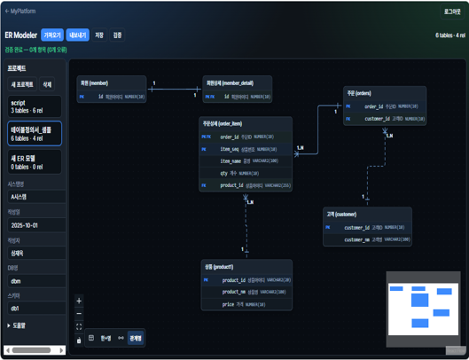

# MyPlatform 공통 — 사용자 매뉴얼

## 1. 개요

**MyPlatform**은 DB 표준 점검, DBManager, 소스·웹 품질 진단, ER Modeler, MyGantt 등 여러 도구를 **웹 브라우저(데스크톱·모바일)** 에서 사용할 수 있게 묶어 둔 포털입니다.

| 항목 | 내용 |
|------|------|
| **접속 URL** | `/` (로컬: `http://127.0.0.1:3000`) |
| **로그인** | `/login` |
| **상태** | beta (대부분 앱) |

---

## 2. 화면 구성

### 2.1 로그인 화면 (`/login`)

| 영역 | 설명 |
|------|------|
| **Hero** | "MyPlatform" 제목, 포털 암호 입력 안내 |
| **암호 입력** | `PORTAL_PASSWORD`와 일치해야 로그인 |
| **로그인 버튼** | 성공 시 이전 페이지 또는 홈(`/`)으로 이동 |
| **오류 메시지** | 암호 불일치, 서버 미설정 시 표시 |

**작동 방식:** 브라우저에 세션 쿠키가 저장됩니다. 이후 모든 앱 경로는 미들웨어가 로그인 여부를 검사합니다.

### 2.2 포털 홈 (`/`)



| 영역 | 설명 |
|------|------|
| **상단 내비** | `MyPlatform으로 돌아가기`, **로그아웃** |
| **Hero** | 플랫폼 소개 문구 |
| **인프라 배지** | Vercel, Render, Supabase 등 배포 링크 (환경 변수 설정 시) |
| **앱 카드 그리드** | 등록된 8개 프로그램 — 이름, 설명, 상태(`beta`), **열기** 버튼 |

### 2.3 앱 공통 레이아웃

대부분의 앱 페이지는 다음 패턴을 따릅니다.

1. **PortalNav** — 홈으로 돌아가기, 로그아웃
2. **Hero** — 앱 이름과 한 줄 설명
3. **패널(panel)** — 설정·실행·결과 영역
4. **메시지 영역** — 진행 상태, 오류, 완료 안내

ER Modeler, MyGantt는 전용 상단 바를 사용합니다.

---

## 3. 등록된 프로그램 목록

| 이름 | 경로 | 분류 |
|------|------|------|
| 소스코드·보안 진단 | `/apps/source-scan` | 품질 |
| 웹 품질 진단 | `/apps/web-quality` | 품질 |
| 성능 진단 | `/apps/perf-test` | 품질 |
| DB 표준 점검 | `/apps/chk-db-std` | DB·설계 |
| DBManager | `/apps/db-manager` | DB·설계 |
| ER Modeler | `/apps/er-modeler` | DB·설계 |
| DeliverableManager | `/apps/deliverable-manager` | 업무 |
| ReceiptToPDF | `/apps/receipt-to-pdf` | 모바일 |
| MyGantt | `/apps/my-gantt` | 업무 |

---

## 4. API 연동 방식 (작동 원리)

```
브라우저 → Next.js 포털 (/api/backend/...) → FastAPI (apps/api)
```

| 상황 | 동작 |
|------|------|
| **로컬 개발** | 포털이 `NEXT_PUBLIC_API_BASE_URL`로 API 프록시 |
| **Vercel 배포** | 동일 프록시 또는 대용량 업로드 시 API 직접 연결 |
| **인증** | 포털 쿠키 + `X-Api-Key` 헤더 |

API가 필요한 앱: 소스코드·보안 진단, 웹 품질 진단, DB 표준 점검, DBManager, ER Modeler(가져오기/내보내기).

브라우저만으로 동작하는 앱: ReceiptToPDF(전부), ER Modeler(프로젝트 저장), MyGantt(로컬 모드), DeliverableManager(목록 조회·상태).

---

## 5. 사용 방법 (처음 시작)

1. 관리자가 `PORTAL_PASSWORD`와 API URL을 설정합니다.
2. 브라우저에서 포털 주소를 엽니다.
3. **로그인** 화면에서 암호를 입력합니다.
4. 홈에서 원하는 프로그램 **열기**를 클릭합니다.
5. 작업 후 **MyPlatform으로 돌아가기**로 다른 앱으로 이동하거나 **로그아웃**합니다.

---

## 6. 데이터 보관 정책

| 데이터 종류 | 보관 위치 |
|-------------|-----------|
| 공통 샘플 Excel, 표준 CSV | Supabase Storage |
| 진단 이력 (소스·웹 품질) | API 서버 `data/*_history/` (파일 JSON) |
| ER Modeler / MyGantt 프로젝트 | 브라우저 IndexedDB·localStorage |
| ReceiptToPDF | 브라우저 IndexedDB + 기기 다운로드 폴더 |
| DeliverableManager 작성 상태 | 브라우저 localStorage |

---

## 7. 자주 묻는 질문

**Q. API 연결 오류가 납니다.**  
A. `NEXT_PUBLIC_API_BASE_URL`이 올바른지, API 서버(`uvicorn`)가 실행 중인지 확인하세요.

**Q. 로그인이 안 됩니다.**  
A. `apps/portal/.env.local`의 `PORTAL_PASSWORD` 설정 후 개발 서버를 재시작하세요.

**Q. 모바일에서도 쓸 수 있나요?**  
A. 포털 UI는 반응형입니다. 단, 소스 진단·웹 품질(Playwright)은 API 서버가 필요하고, 대용량 ZIP은 PC 권장입니다.
