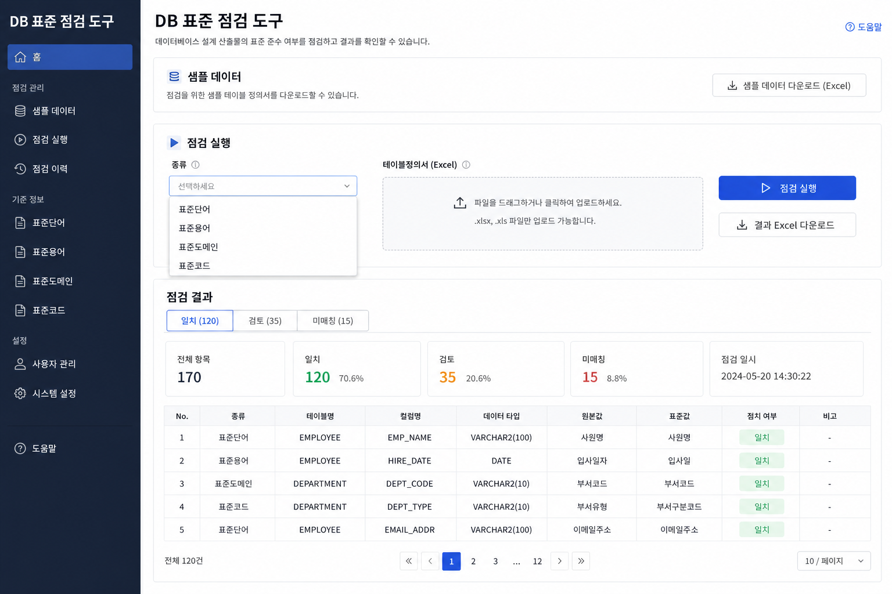
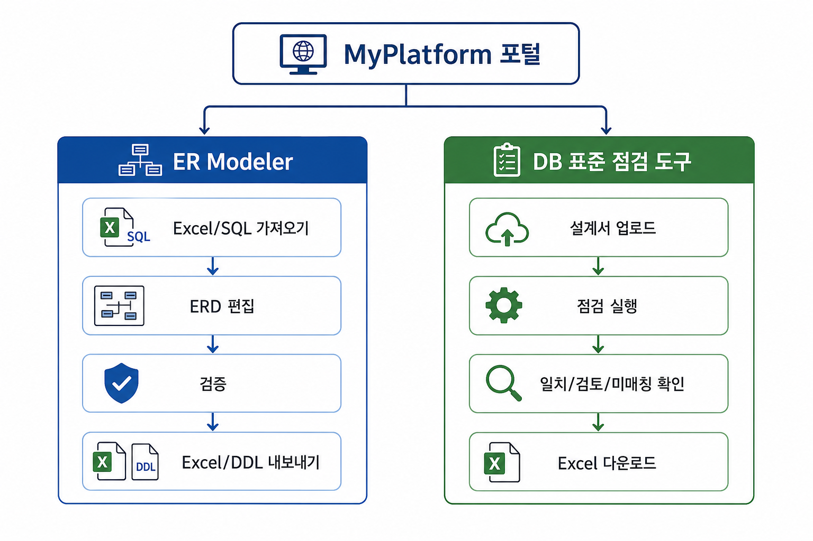

# DB 표준 점검 — 사용자 매뉴얼

## 1. 개요

| 항목 | 내용 |
|------|------|
| **프로그램명** | DB 표준 점검 도구 |
| **URL** | `/apps/chk-db-std` |
| **목적** | 행정안전부(MOIS) **공통표준단어·용어·도메인·코드**와 설계서(Excel)의 일치 여부 점검 |
| **표준 사전** | MOIS 기본 CSV (서버 번들) 또는 사용자 CSV 업로드 |



---

## 2. 화면 구성

### 2.1 Hero

- DB 표준 점검 도구 소개

### 2.2 샘플 데이터

| 기능 | 설명 |
|------|------|
| **샘플 다운로드** | kind별 예제 Excel (테이블정의서, 코드정의서) |
| **파일 정보** | 제목, 설명, 용량 |

### 2.3 점검 실행 패널

| UI 요소 | 기능 |
|---------|------|
| **점검 종류 (kind)** | word / term / domain / code |
| **시트명** | Excel 시트 (자동 감지 가능) |
| **설계서 Excel** | `.xlsx` 업로드 |
| **표준 CSV (선택)** | 단어/용어/도메인 CSV — 미업로드 시 MOIS 기본 |
| **점검 실행** | API `/run` 호출 |
| **결과 Excel** | 점검 결과 xlsx 다운로드 |
| **단어집·용어집** | word-dict / term-dict xlsx 생성 |

### 2.4 점검 결과 패널

| 영역 | 설명 |
|------|------|
| **통계** | match / review / unmatch 건수 |
| **결과 탭** | 일치 / 검토 / 미매칭 |
| **검색** | 컬럼명·한글명 등 필터 |
| **결과 테이블** | 행별 매칭 상태, 표준값, 비고 |

#### 결과 탭

| 탭 | 의미 |
|----|------|
| **일치 (match)** | 표준과 완전 일치 |
| **검토 (review)** | 부분 일치 — "영문 불일치만" 필터 가능 |
| **미매칭 (unmatch)** | 표준에 없음 |

### 2.5 표준용어 생성 패널

| 기능 | 설명 |
|------|------|
| **한글명 입력** | 줄 단위로 여러 개 입력 가능 |
| **생성 실행** | 표준용어·영문약어 조회 |
| **결과 표** | exact(표준용어) / composed(단어조합) / none |
| **권장 영문명 복사** | 클립보드 복사 버튼 |

---

## 3. 점검 종류 (kind) 상세

| kind | 입력 파일 | 점검 내용 |
|------|-----------|-----------|
| **word** | 테이블정의서 Excel | 컬럼·속성명이 **공통표준단어**에 있는지 |
| **term** | 테이블정의서 Excel | **공통표준용어** (한글명·영문약어) |
| **domain** | 테이블정의서 Excel | **공통표준도메인** (데이터 타입·길이) |
| **code** | 코드정의서 Excel | **공통표준코드** 값 |

---

## 4. 작동 방식

```
Excel 업로드 → validate (형식·시트 자동 감지)
    → (선택) 사용자 CSV 또는 MOIS 기본 사전 로드
    → kind별 매칭 엔진 실행
    → match / review / unmatch 분류 + stats
    → (캐시) 동일 파일+kind면 재실행 생략 가능
    → JSON 결과 → UI / xlsx export
```

**설계서 형식 자동 감지:** 목록형, 블록형, 코드정의서 등 여러 양식 지원.

---

## 5. 사용 방법 (단계별)

### 5.1 표준단어 점검

1. **점검 종류** → **word** 선택
2. 테이블정의서 `.xlsx` 업로드 → 검증 메시지 확인
3. **점검 실행**
4. **미매칭** 탭에서 표준 미등록 단어 확인
5. **결과 Excel** 다운로드

### 5.2 DBManager에서 넘어온 경우

1. DBManager **설계서 → 스크립트** 탭에서 **DB 표준 점검으로** 클릭
2. 설계서가 자동 handoff (`?from=db-manager`, IndexedDB)
3. kind 선택 후 **점검 실행**

### 5.3 표준용어 생성

1. 하단 **표준용어 생성**에 한글 컬럼명 입력 (한 줄에 하나)
2. **생성** 클릭
3. **exact**면 표준용어 그대로 사용, **composed**면 단어 조합 권장 영문명 참고

---

## 6. 입력·출력

| 구분 | 형식 |
|------|------|
| **입력** | `.xlsx` 테이블정의서 또는 코드정의서; optional `.csv` 표준 |
| **출력 (화면)** | match[], review[], unmatch[], stats |
| **출력 (파일)** | `chkdbstd_{kind}_result.xlsx`, word-dict.xlsx, term-dict.xlsx |

---

## 7. 환경 요구사항

- API 모듈: `apps/api/chkdbstd/`
- MOIS CSV + code index (`pkl`) 서버 번들
- `CHKDBSTD_DIR` (선택) — 표준 파일 경로 override

---

## 8. ER Modeler·DBManager와의 관계



| 흐름 | 설명 |
|------|------|
| Excel 설계서 → **DB 표준 점검** | 명명·도메인 표준 준수 확인 |
| Excel → **DBManager** | DDL 생성·DB 적용 |
| Excel → **ER Modeler** | ERD 편집 후 다시 Excel export → 표준 점검 |

동일 **테이블정의서 Excel 양식**을 공유합니다.
