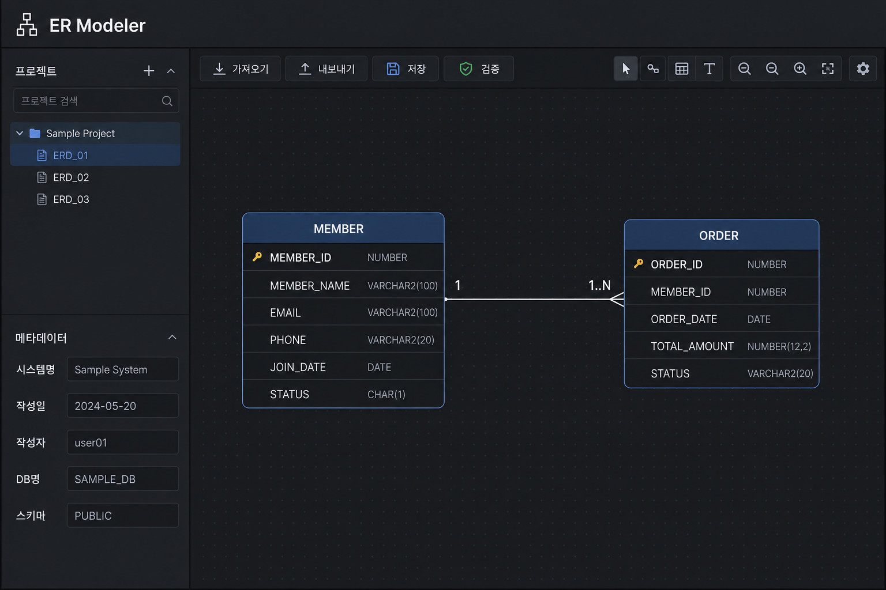
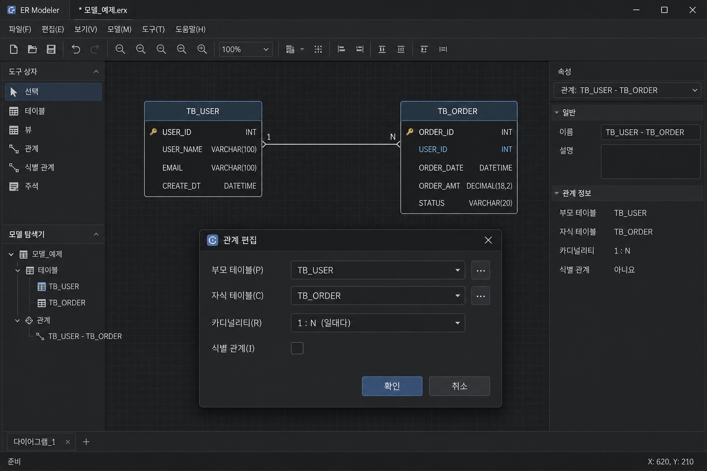

# ER Modeler — 사용자 매뉴얼

## 1. 개요

| 항목 | 내용 |
|------|------|
| **프로그램명** | ER Modeler |
| **URL** | `/apps/er-modeler` |
| **목적** | 테이블정의서(Excel) 또는 SQL을 ERD로 가져와 **시각 편집** 후 설계서·DDL·다이어그램 내보내기 |
| **저장** | 브라우저 로컬 (IndexedDB/localStorage) — 서버 DB 불필요 |



---

## 2. 화면 구성

### 2.1 상단 바 (Top bar)

| 버튼 | 기능 |
|------|------|
| **가져오기** | Excel 또는 SQL import |
| **내보내기** | Excel, PostgreSQL DDL, PNG/SVG/PDF |
| **저장** | 현재 프로젝트 로컬 저장 |
| **자동 배치** | 테이블 노드 레이아웃 정렬 |
| **검증** | 모델 오류 목록 + 클릭 시 해당 테이블로 이동 |

### 2.2 왼쪽 사이드바

| 영역 | 기능 |
|------|------|
| **프로젝트 목록** | 저장된 프로젝트 전환 |
| **새 프로젝트 / 삭제** | 프로젝트 CRUD |
| **테이블 검색** | 이름 필터 |
| **DB명 / 스키마** | 메타 정보 편집 |
| **도움말** | 단축키·사용 팁 |

### 2.3 캔버스 (중앙)

ReactFlow 기반 ERD:

| 요소 | 설명 |
|------|------|
| **테이블 노드** | 컬럼 목록, PK/FK 표시 |
| **관계 엣지** | FK 연결선, 카디널리티 라벨 |
| **MiniMap** | 전체 축소 지도 |
| **Controls** | 줌·팬 |

### 2.4 하단 도구栏

| 도구 | 단축/동작 |
|------|-----------|
| **선택** | Shift+클릭 다중 선택 |
| **새 테이블** | 캔버스 클릭으로 배치 |
| **연결** | 테이블 간 드래그 → FK + 카디널리티 선택 |
| **자물쇠** | 노드 이동·연결 잠금 |
| **이름 표시** | 한+영 / 한글만 / 영문만 |
| **관계 라벨** | 1:1, 1:N 등 표시 토글 |

**키보드:** `Ctrl+Z` / `Ctrl+Y` — undo/redo

---

## 3. 대화상자 (Dialogs)

| 대화상자 | 기능 |
|----------|------|
| **가져오기** | Excel / SQL 선택; replace(전체 교체) vs append(추가) |
| **가져오기 미리보기** | 추가·건너뜀 테이블 확인 후 적용 |
| **내보내기** | Excel, PostgreSQL script(zip), PNG/SVG/PDF 다이어그램 |
| **테이블 편집** | 영문 ID, 한글명 |
| **컬럼 편집** | 타입, PK/FK, nullable, comment |
| **관계 편집** | 카디널리티 (1:1, 1:1..N, 1:N 등) |



---

## 4. 기능 상세

### 4.1 Import (가져오기)

| 소스 | API | 동작 |
|------|-----|------|
| **Excel** | `POST /v1/er-modeler/import` | 테이블정의서 → ErProject JSON |
| **SQL** | `POST /v1/er-modeler/import-sql` | CREATE/ALTER/COMMENT 파싱 |

### 4.2 Export (내보내기)

| 형식 | 설명 |
|------|------|
| **Excel** | DBManager·chk-db-std 호환 설계서 |
| **PostgreSQL DDL** | Index Key 기반 PK/FK/UK/INDEX — zip 또는 json |
| **PNG / SVG / PDF** | 클라이언트 캔버스 캡처 |

### 4.3 검증 규칙

| 검사 | 설명 |
|------|------|
| 고아 테이블 | FK 없이 고립 |
| FK 타입 불일치 | 참조 컬럼 타입 다름 |
| PK 없음 | 기본키 미정의 |
| 순환 FK | 순환 참조 |

클릭 시 해당 테이블/관계로 **jump**.

### 4.4 로컬 프로젝트 저장

- **ErProject** JSON: tables, relations, positions
- 다중 프로젝트 — 브라우저별 독립
- **자동 저장** (편집 시)

---

## 5. 작동 방식

```
Excel/SQL → API import → ErProject (클라이언트 state)
    → ReactFlow 렌더 → 사용자 편집
    → (export) API generate 또는 클라이언트 diagram
    → localStorage/IndexedDB persist
```

DB 연결 없이 import/export API만 사용합니다 (generate DDL은 모델 JSON 기반).

---

## 6. 사용 방법 (단계별)

1. **새 프로젝트** 또는 **가져오기** (Excel/SQL)
2. **가져오기 미리보기** 확인 → 적용
3. 캔버스에서 테이블 추가·컬럼 편집·**연결**로 FK 생성
4. **자동 배치**로 정리
5. **검증** → 오류 수정
6. **내보내기** — 설계서 Excel / DDL zip / 다이어그램
7. **저장** (로컬)

### DB 표준 점검과 함께 쓰기

1. ER Modeler에서 Excel export
2. **DB 표준 점검** 앱에서 word/term/domain 점검
3. 수정 후 다시 import

---

## 7. 입력·출력

| 구분 | 형식 |
|------|------|
| **입력** | `.xlsx` 테이블정의서; SQL 파일/텍스트 |
| **내부** | ErProject JSON |
| **출력** | Excel, PostgreSQL DDL zip, PNG/SVG/PDF |

---

## 8. 주의사항

- 프로젝트는 **브라우저 로컬** — 다른 PC·시크릿 모드에서는 없음 (export로 백업)
- SQL import는 모든 dialect 완벽 지원 아님 — PostgreSQL CREATE 위주
- 대형 모델(100+ 테이블)은 캔버스 성능 저하 가능 — 검색·자동배치 활용
